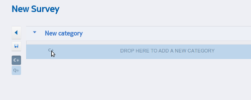
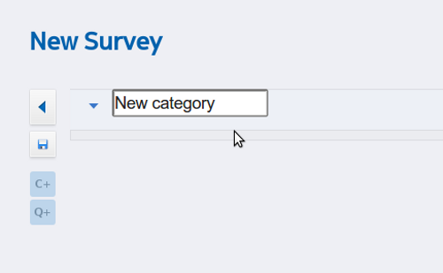
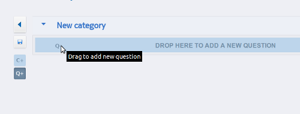

.. _editor:

*******
Editor
*******

A new or existing survey has a name which can be clicked to edit and any number of categories and questions. Actually adding categories and questions is done by dragging from the **Drag to add new category** and **Drag to add new question** plus + buttons.

   A new category being dragged into a survey

drop either above or below existing categories and the new category will appear. Click the name to edit

   Click category name to edit

then drag the new question plus + button to add a question

   A new question being dragged into a survey

then click the new question text to edit the question you would like to ask.

|new-question_png|

Clicking the question text will open out into the :doc:`questions` toolbar

 
