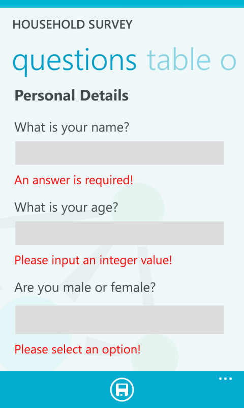

.. _editor:

*******
Editor
*******

The editor is where new surveys or questionnaires are built and saved. This is the screen you will see after clicking the Create a new Survey button

.. figure:: images/builder.png
   :alt: Builder

and when editing the survey title. Click the green tick to save any changes

.. figure:: images/edit_survey_title.png
   :alt: Editing the survey title

Various :doc:`questions` are available to select and for this editor tutorial we will create a short household survey. This will demonstrate some of the functionalities of the editor. To start create a descriptive question for name, and integer question for age and an exclusive choice question for the sex of the respondent. This can be seen below

.. figure:: images/household.png
   :alt: Household Survey

we will skip the Women's Health category if the respondent answered that their sex is male. This is done by adding a skip logic option. Select the DEFAULT Go To be the Household Income category (which follows the Women's Health category) and then 'If the Answer is Female then skip to Women's Health'

.. figure:: images/skip_logic_option.png
   :alt: Skip Logic Option

In the Household Income category add a note saying that questions about income are optional 

.. figure:: images/note.png
   :alt: Note to the respondent

and then save the survey. Move to the Survey List and send the survey

.. figure:: images/send_household_survey.png
   :alt: Send household survey

Open the mobile application as click the button to refresh the list of surveys

.. figure:: images/toolbar_wp.png
   :alt: Windows phone toolbar

to make the survey appear. 

.. figure:: images/survey_list_wp.png
   :alt: Windows phone survey list

Click on the survey name and click the plus icon to begin a new response

.. figure:: images/new_response_wp.png
   :alt: Windows phone new response

then fill in the answers as appropriate

 
