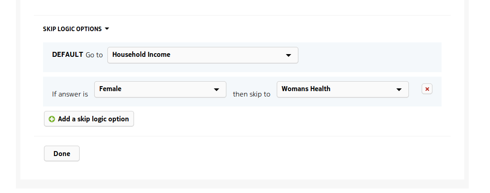

.. _editor:

*******
Editor
*******

The editor is where new surveys or questionnaires are built and saved. This is the screen you will see after clicking the Create a new Survey button

and when editing the survey title. Click the green tick to save any changes

.. figure:: images/edit_survey_title.png
   :alt: Editing the survey title

Various :doc:`questions` are available to select and for this editor tutorial we will create a short household survey. This will demonstrate some of the functionalities of the editor. To start create a descriptive question for name, and integer question for age and an exclusive choice question for the sex of the respondent. This can be seen below

.. figure:: images/household.png
   :alt: Household Survey

we will skip the Women's Health category if the respondent answered that their sex is male. This is done by adding a skip logic option. Select the DEFAULT Go To be the Household Income category and then 'If the Answer is Female then skip to Women's Health'

In the Household Income category add a note saying that questions about income are optional 

.. figure:: images/note.png
   :alt: Note to the respondent

and then save the survey. The final survey should look like the image below

Move to the Survey List and send the survey

.. figure:: images/send_household_survey.png
   :alt: Send household survey

Open the mobile application as click the button to refresh the list of surveys

.. figure:: images/toolbar_wp.png
   :alt: Windows phone toolbar

to make the survey appear. 

Click on the survey name and click the plus icon to begin a new response

then fill in the answers as appropriate. Selecting the male option for the question "Are you male or female?" in the Category "Personal Details" moves directly to the "Note" question in the "Household Income". Selecting the female option for the question "Are you male or female?" in the Category "Personal Details" moves to the question "Have you ever been pregnant?" question in the Category "Womans Health"

*Note*

It is the "DEFAULT Go To" which is important when using switch logic and conditional answers *do not* override that. As an example - in the previous switch logic options if the "DEFAULT Go To" is Next Question and the condition is "if male then skip to Household Income" as shown below

then answering *either* male or female to the "Are you male or female?" question will take the user to the next question "Have you ever been pregnant?" in the Category "Womans Health". Answering "male" does not override the "DEFAULT Go To" for this question.

Sometimes a "DEFAULT Go To" or conditions will conflict. In such instances the error is detected by the system and the user asked to verify the logic  

