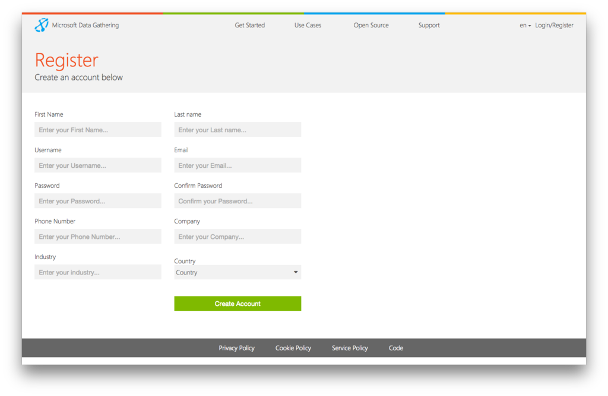

.. _getting-started:

**********************
Getting started
**********************

To get started with Nokia Data Gathering, you need to create an account on our Playground Server. To do this, go to `the server 
<http://nokiadatagathering.net>`_ and fill in the fields shown in the box on the right hand side of the screen. Select a username and password, and enter your first name, last name, email address, phone number and company/organization affiliation in the appropriate boxes. Then click the Create Account button. 

   The registration form

After you have filled in the requested information and submitted it, a confirmation email will be sent to the email address you entered. To complete the registration process, you need to click on the link provided in the email. After your Nokia Data Gathering Playground account has been confirmed, you will be able to return to the server and log in with the username and password you selected.

NOTE: If you have problems clicking through to the link send in the email, please copy-paste the URL into your browser. 
NOTE: You need to enter your phone number in international format (including the country code).

