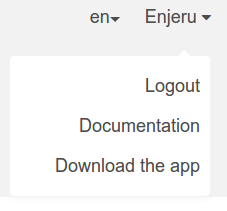
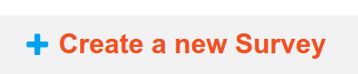

.. _getting-started:

**********************
Getting Started
**********************

To get started with Microsoft Data Gathering, you need to create an account on our Playground Server. To do this, go to `the server 
<https://nokiadatagathering.net>`_ and fill in the fields shown in the box. Select a username and password, and enter your first name, last name, email address, phone number and company/organization affiliation in the appropriate boxes. Then click the Create Account button. This will create a super admin account on the server which has permissions to add other admin users, field workers and operators. Normally organisations only need to register once to the playground server and then the super admin account be given to the person responsible for data gathering within the organisation

**In the context of NDG an admin role can add, delete and edit both users and surveys from the server. Operators can log into the server and manipulate surveys but they cannot change other users information. Field workers cannot log in to the server but can send and receive surveys and results from the field**

.. figure:: images/register.png
   :alt: Register as a super admin to the server

NOTE: This registration form is also accessible using screen readers and accessibility tools for those with visual impairment

After you have filled in the requested information and submitted it, a confirmation email will be sent to the email address you entered. To complete the registration process, you need to click on the link provided in the email. After your Microsoft Data Gathering Playground account has been confirmed, you will be able to return to the server and log in with the username and password you selected.

NOTE: If you have problems clicking through to the link sent in the email, please copy and paste the URL into your browser. 

NOTE: You need to enter your phone number in international format (including the country code). For example to enter a UK number type 441236112233

If you have not already installed the mobile application on your phone now is a good time to read :doc:`install`. tl;dr is on your mobile device open a browser and go to the `getting started <https://nokiadatagathering.net/#/getStarted>`_  page on microsoftdatagathering.net and click the appropriate icon in **Step 3: Download the Microsoft Data Gathering mobile application**.  

NOTE: The download is also available by clicking the down arrow next to your user name and selecting **Download the app** as shown below 

After installing the mobile application on your phone you can (back on the PC) start creating a new Survey by clicking on the button shown

You will then be using our integrated survey :doc:`editor`

