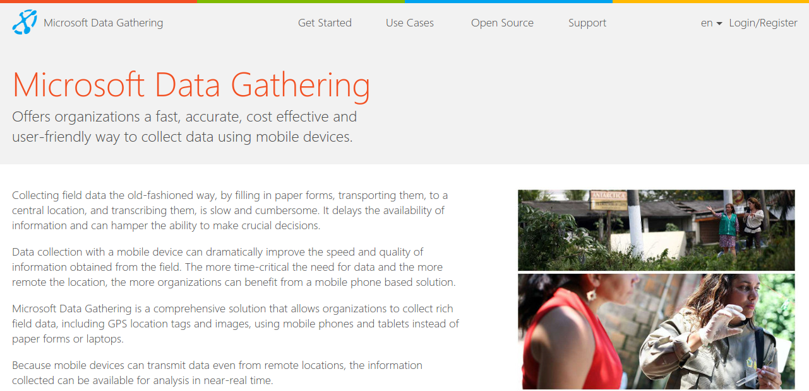

.. Nokia Data Gathering documentation master file, created by
   sphinx-quickstart on Tue Mar 20 16:26:14 2012.
   You can adapt this file completely to your liking, but it should at least
   contain the root `toctree` directive.

Welcome to Nokia Data Gathering's server documentation!
=======================================================

**I'm ready to** `start collecting data <https://nokiadatagathering.net>`_
---------------------------------------------------------------------------

Contents:

.. toctree::
   :maxdepth: 2

   intro.rst   
   solution-overview.rst
   release-archive.rst
   getting-started.rst
   install.rst
   survey-list.rst
   editor.rst
   questions.rst
   results.rst
   searching.rst
   user-admin.rst

