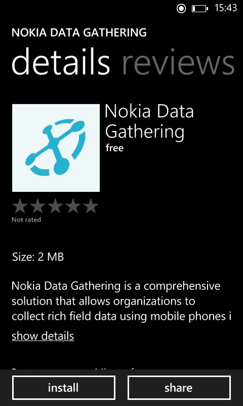

.. _install:

*********************************
Installing the Mobile Application
*********************************

In order to receive, complete and then send a survey result back you need to have a mobile application installed

.. figure:: images/install.png
   :alt: Marketplace

You can download the application by going to this link on your `Windows Phone <http://www.windowsphone.com/s?appid=a2bd7f51-6c7f-48d4-9fa7-12b35c550848>`_ and  this link on your `Windows tablet <http://apps.microsoft.com/windows/app/nokia-data-gathering/4780fc68-fc8b-4db4-8cf7-110fe07dac42>`_ and clicking the install button. The java app can be downloaded `here <https://nokiadatagathering.net/ndg-ota/client/ndg.jad>`_

