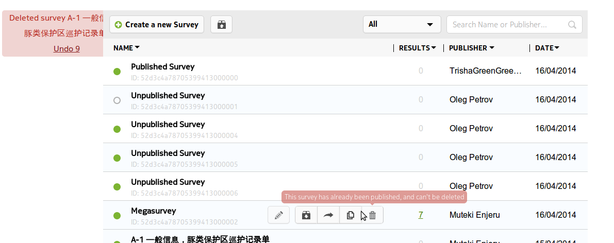
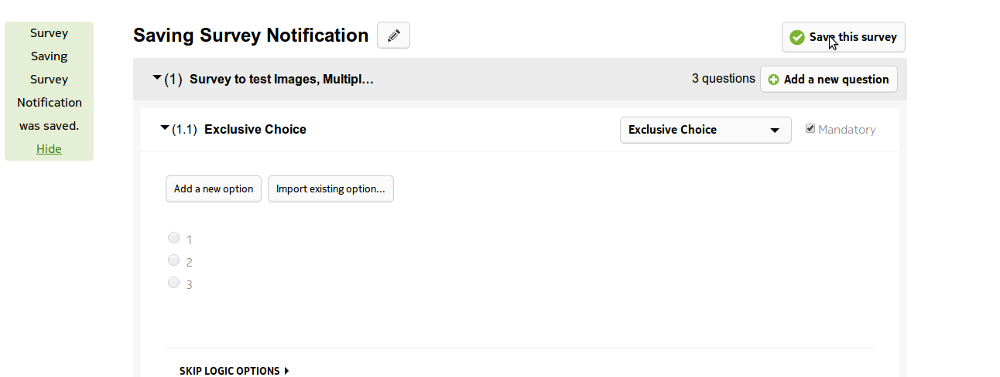

.. _notifications:

*************
Notifications
*************

Some actions have notifications which can be undone if selected in error by a user. For example take a look at the notification we see when trying to delete a survey (only unpublished surveys can be deleted) 

Such notifications are used throughout the application. Look at the notification when saving a survey for example

