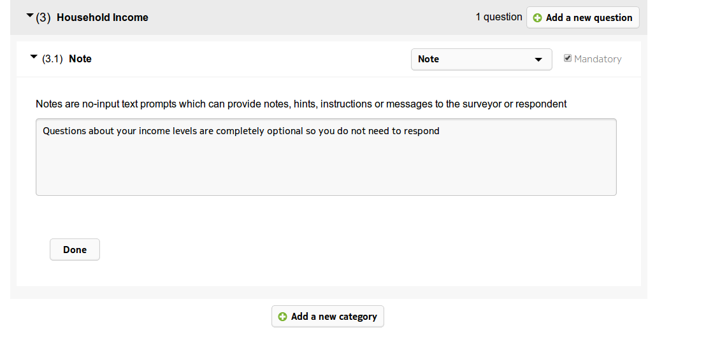

.. _questions:

**************
Question Types
**************

All of the questions can be made required or not by checking the `Mandatory` check box 

**Question Types**

1. Descriptive

Descriptive questions are used for text type questions. A default answer can be provided (smith in the example below) and the input can also we masked. This means that the answer must be follow the pattern provided in order to be valid. This is useful when dealing with legacy databases which require a specific 'key' value

2. Exclusive Choice

Exclusive Choice questions are used when there is one unique answer. They can be used to :doc:`skip` questions based on their responses. Options can either be added by clicking the 'Add a new option' button or can be imported from Excel. To use this feature create a spreadsheet with a single column containing one option per line and save the file with a .csv extension.

Then select that file after clicking the Import existing option..

3. Multiple Choice

Multiple Choice questions are used for questions with many possible answers. Options can either be added by clicking the 'Add a new option' button or can be imported from Excel. To use this feature create a spreadsheet with a single column containing one option per line and save the file with a .csv extension.

4. Image

Image questions are used when the response should be an image. 

5. Date

Date questions are used for date questions. A default date can be chosen as well as a range specified

6. Decimal

Decimal questions are used when the answer should be a decimal. A default and a maximum and minimum can be added

7. Integer

Integer questions are used when the answer should be a whole number. A default and maximum length can be added

8. Time

Time questions are used for time type questions. A default can be added. Use the up/down arrows to scroll hours, minutes and seconds.

   
9. Location

This will take a GPS reading and attach it to the question

   
10. Notes

Notes are no-input text prompts which can provide notes, hints, instructions or messages to the surveyor or respondent

11. Cascading Select
Used we want to present the interviewee with a series of selection questions, where the answer depends on a previous selection. This is best shown by an example. Start by adding 3 options called 1,2 and 3

Then select option 1 and click the Add a new option box to the right and add the option 1.1

Add options 1.2 and 1.3 

and then for option 2 add 2.1,2.2 and 2.3 and for option 3 add 3.1,3.2 and 3.3. The final cascade will look like

So if the user selects the first option 1 in the subsequent select they will only be able to select from 1.1,1.2 and 1.3 and if they select the first option 2 they will only be able to select from 2.1,2.2 and 2.3 and so on