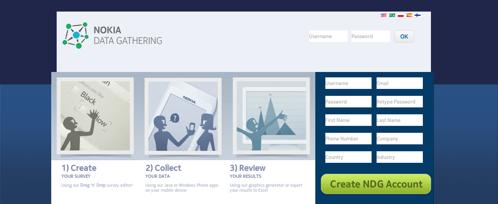

.. _release-archive:

**********************
Release Archive
**********************

**4.04 Dazzling Dourado**
 Included an updated Java client, a new server, and a new WP client. The WP client of Nokia Data Gathering was developed through a partnership between Nokia, Seton Hall University’s Center of Mobile Research and Innovation, and Microsoft. The roadmapping meeting for the next release was held at Seton Hall University in New York, USA

**4.11 Electric Edison**   
Added a Geopoint Question type as well as mandatory questions. Also a scheduler was developed to automatically export results. The roadmapping meeting for the next release was held at Fundação de Vigilância em Saúde do Amazonas (FVS/AM) in Manaus, Amazonas, Brazil

**5.04/5.11 Flying Finn**
Many bugfixes and improvements in usability with many editor enhancements. Allowed editing of user accounts and for a user to become part of multiple groups. Surveys can also be sent to groups. 

**6.04 Gilas Guinan**  
The server was rewritten in node.js with new switch logic, cascading selects and note type questions. A client was developed for windows phone 8 and also a tablet version of the app. The roadmapping for this release was held in Manila, The Phillipines      

 

