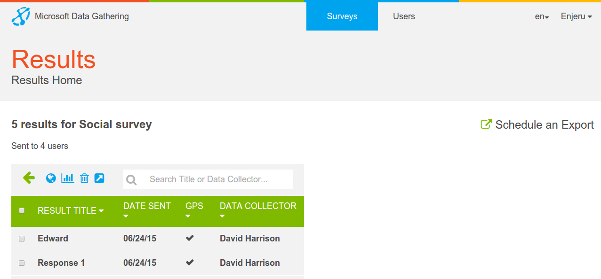
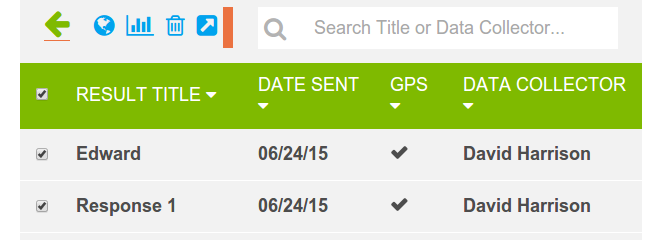

.. _results:

*******
Results
*******

Clicking on the number of results link on the :doc:`survey-list` page shows the Results List page

   Results Page

with the Result Title, Date Sent, User and Location information displayed. Clicking the select box next to the Result Title selects all results

   All results selected

and clicking again deselects all. Results can also be selected individually and once the required set are chosen can either be exported (to either Excel or KML) or can be represented visually.
If results in the selected set have images then a dialogue is presented when exporting to Excel

.. figure:: images/export-images.png
   :alt: Export results with images

   Export results with images

Selecting the Graph View button shows the Survey Name along with a list of all the questions in the survey. Exclusive choice type questions have a link to represent the selected results as a Pie Chart and Integer type questions have a link to represent the selected results as a Bar chart. 

.. figure:: images/graphing.png
   :alt: Graphing Options

   Graphing Options

Clicking Bar Chart for example will show a bar chart with the total Number of Answers as the y axis and the question on the x

   How many times do you laugh per day?

along with buttons to save or view the generated image.Clicking Pie Chart will show a pie chart with the questions represented as colors with a legend embedded

   Are you a talker, thinker or doer

again with the same buttons to save or view the image.

Selecting Map View will display a map with the location of survey responses. Clicking on the icon will show information about the response returned from that location. The map can be panned and zoomed or displayed in either the default or satellite/terrain.

