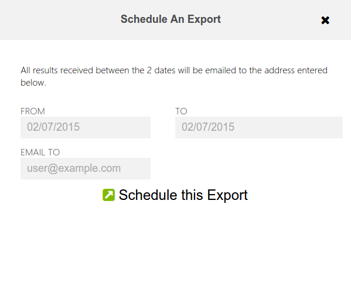

.. _results:

*******
Results
*******

Clicking on the number of results link on the :doc:`survey-list` page shows the Results List page and its toolbar

.. figure:: images/results-page.png
   :alt: Results Page

with the Result Title, Date Sent, User and Location information displayed. Clicking the select box next to the Result Title selects all results

.. figure:: images/select-all-results.png
   :alt: Select All Results

and clicking again deselects all. Results can also be selected individually. Results can be previewed by clicking anywhere on the result

.. figure:: images/preview-result.png
   :alt: Preview Result

This preview functionality is also available on the map by clicking on the points of interest

Once the required set are chosen they can be exported (to either Excel, CSV or KML) or can be represented visually.
To export click that icon on the toolbar

Rather than manually exporting, results can be exported automatically using the schedule button. This presents options to select the date from and to and also an email address to send the export. Any results then collected for that particular survey during those the dates will be sent as an attachement to the email

Selecting the 'View Selected Results on a Chart' button from the results toolbar opens a pop up where questions which can be represented using charts are displayed 

Clicking Bar Chart for example will show a bar chart with the respondents answer as the x axis and the number of respondents as the y 

.. figure:: images/bar.png
   :alt: How old are you?

   How old are you?

Clicking the image will bring an option to save it locally.Clicking Pie Chart will show a pie chart with the questions represented as colors with a legend embedded

.. figure:: images/pie.png
   :alt: Are you crab?

   Are you crab?

Selecting Map View will display a map with the location of survey responses. Clicking on the icon will show information about the response returned from that location. The map can be panned and zoomed or displayed in either the default or satellite/terrain. Clicking on the points displays a preview of that result

.. figure:: images/map.png
   :alt: map View
   

