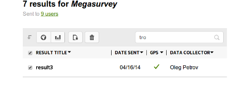
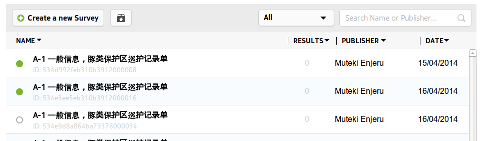

.. _searching:

***************************
Search and Column Filtering
***************************

Search is both contextual and dynamic. This means that different search options are presented depending on whether you are in the :doc:`survey-list`, :doc:`user-admin` or :doc:`results`

.. figure:: images/survey-search.png
   :alt: Searching for Surveys

   Searching for Surveys

The above image shows that surveys can be search for Name or Publisher. Entering 'tro' in the search box will filter all surveys to include these letters

.. figure:: images/context-survey-search.png
   :alt: Contextual Survey Search

   Contextual Survey Search

The same principle applies when searching Results 

   Search Results 

and also when searching Users. The :doc:`survey-list`, :doc:`user-admin` or :doc:`results` columns can also be sorted and this is done by clicking to the side of the column to be filtered where a small black arrow is displayed 

   Sorting Surveys by Date (Oldest First)

   
