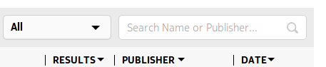
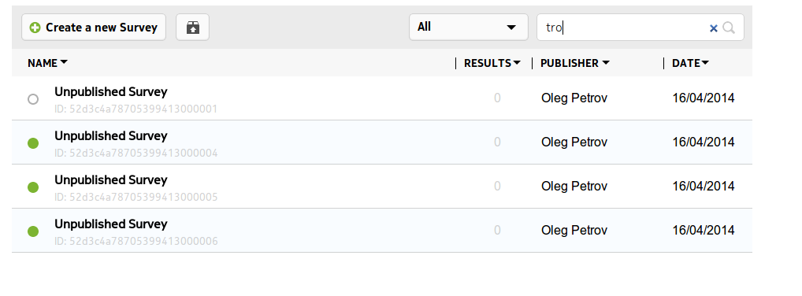

.. _searching:

*******
Search
*******

Search is both contextual and dynamic. This means that different search options are presented depending on whether you are in the :doc:`survey-list`, :doc:`user-admin` or :doc:`results`

   Searching for Surveys

The above image shows that surveys can be search for using ID, Name or Publisher. Selecting Survey Name from the drop down and 't' in the search box will filter all Survey Names with 't' as seen below

   Contextual Survey Search

The same principle applies when searching results

