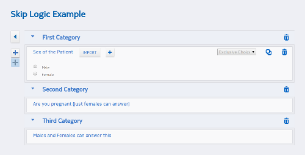
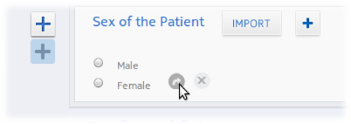
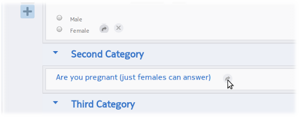
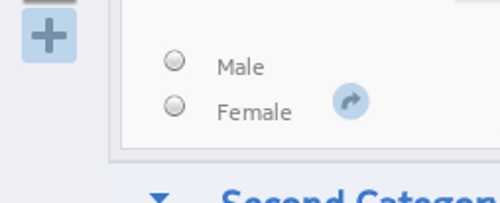

.. _skip:

***********
Skip Logic
***********

Skip Logic which is also called relevance is a way to make a question be skipped based on the value of another question.

The best way to explain how this works is through an example which is taken from the `XForms Training Materials <https://bitbucket.org/javarosa/javarosa/wiki/buildxforms>`_ Suppose we only want to ask the question 'Are you pregnant?' if the sex of the patient is female. In the :doc:`editor` create a survey with an exclusive choice question, the 'Are you pregnant' question and another random question which all respondents can answer. They do not need to be in separate categories but are shown this way for clarity.

   Skip Logic creation in the survey editor

Hovering next to the available options in the exclusive choice question makes an arrow appear. 

This arrow can now be dragged and dropped on the question to be skipped to if this answer option is selected

   Arrows can be dragged to represent skip logic relationships

The relationship is then visually represented by a change in the arrow color on the exclusive choice option

   Skip Logic realtionship represented by a change in arrow color

Anyone now answering 'Male' to the Sex of the Patient exclusive choice question will now not be able to answer the question 'Are you pregnant'. 

Males will still be able to see the question but it will be greyed out and they will be unable to answer it.

------------

**Technical Details**

In the actual survey XML the binding is added to the question that is conditionally skipped, not the question whose answer decides whether the other question is skipped. This is an important distinction that can be confusing. For example, here is the bind for the previous example.

<bind nodeset="/data/category8978/question3539" type="string" relevant="/data/category5824/question9730='female'" />

which means bind the question3539 in category8978 to the answer 'Female' of question question9730 in the category5824.

Here is the full commented survey XML for the skip logic example

::

 <?xml version='1.0' ?>
 <h:html xmlns="http://www.w3.org/2002/xforms" xmlns:h="http://www.w3.org/1999/xhtml" xmlns:ev="http://www.w3.org/2001/xml-events" xmlns:xsd="http://www.w3.org/2001/XMLSchema" xmlns:jr="http://openrosa.org/javarosa">
  <h:head>
    <h:title>Skip Logic Example</h:title>
    <model>
      <instance>
        <!-- the XML inside here is what gets filled out and submitted when you complete the form -->
        <data id="jej6isa7">
          <category5824>
            <question9730></question9730>
          </category5824>
          <category8978>
            <question3539></question3539>
          </category8978>
          <category7233>
            <question5696></question5696>
          </category7233>
        </data>
      </instance>
      <itext>
        <translation lang="eng">
          <text id="/data/category5824:label">
            <value>First Category</value>
          </text>
          <text id="/data/category5824/question9730:label">
            <value>Sex of the Patient</value>
          </text>
          <text id="/data/category5824/question9730:optionmale">
            <value>Male</value>
          </text>
          <text id="/data/category5824/question9730:optionfemale">
            <value>Female</value>
          </text>
          <text id="/data/category8978:label">
            <value>Second Category</value>
          </text>
          <text id="/data/category8978/question3539:label">
            <value>Are you pregnant (just females can answer)</value>
          </text>
          <text id="/data/category7233:label">
            <value>Third Category</value>
          </text>
          <text id="/data/category7233/question5696:label">
            <value>Males and Females can answer this</value>
          </text>
        </translation>
      </itext>
      <!-- binds allow us to add properties to the questions, like data types, skip logic, constraints etc.-->
      <bind nodeset="/data/category5824/question9730" type="select1" />
      <bind nodeset="/data/category8978/question3539" type="string" relevant="/data/category5824/question9730='female'" />
      <bind nodeset="/data/category7233/question5696" type="string" />
    </model>
  </h:head>
  <h:body>
    <!-- This is where we define the questions that the user will fill out -->
    <group>
      <label ref="jr:itext('/data/category5824:label')" />
      <select1 ref="/data/category5824/question9730">
        <label ref="jr:itext('/data/category5824/question9730:label')" />
        <item>
          <label ref="jr:itext('/data/category5824/question9730:optionmale')" />
          <value>male</value>
        </item>
        <item>
          <label ref="jr:itext('/data/category5824/question9730:optionfemale')" />
          <value>female</value>
        </item>
      </select1>
    </group>
    <group>
      <label ref="jr:itext('/data/category8978:label')" />
      <input ref="/data/category8978/question3539">
        <label ref="jr:itext('/data/category8978/question3539:label')" />
      </input>
    </group>
    <group>
      <label ref="jr:itext('/data/category7233:label')" />
      <input ref="/data/category7233/question5696">
        <label ref="jr:itext('/data/category7233/question5696:label')" />
      </input>
    </group>
  </h:body>
 </h:html>

