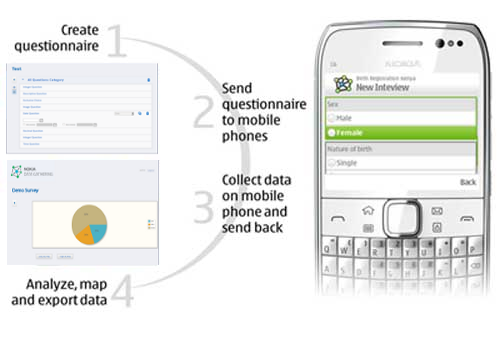

.. _solution-overview:

**********************
Solution Overview
**********************

*How does it work?* 

You start by creating a questionnaire on a survey editor. Then you deliver the questionnaire to your fieldworkers over a wireless or mobile network. Your fieldworkers use the Nokia Data Gathering mobile app on their phones to enter and store responses to the questionnaire and, most importantly, send their results back to the research station, over the mobile network, for instant analysis.

- *Server*: The Server Module is used to create and send surveys to mobile phones, receive interview results, administer users, questionnaires and responses, map data using GPS-based data, graph results and export data. The server can receive interview results in near real-time, provided the field personnel are within range of a mobile voice or mobile data network. 

Additionally, the server can be connected to a GSM modem to send messages and receive responses from the mobile phones of the field personnel.

- *Mobile Phone Application*: The Mobile Phone Module is the only part of the system that is visible to the field personnel. It is the software that appears on their mobile phone, presented as an easy-to-fill questionnaire.

The process with Nokia Data Gathering begins with survey creation, which enables the production of tailored questionnaires. The questionnaires can then delivered to the field workforce wirelessly using a normal mobile telecommunications network. Having received the questionnaire(s) on their mobile phones, the field workforce can then use their phones to enter and store the responses to questions. The system also allows to geo-tag data with GPS location information, providing an additional layer of information and helping to validate data. Once the information is collected, the solution enables them to send responses back for instant analysis, again via a mobile network.

Nokia Data Gathering then is used to create and send surveys to mobile devices via HTTP, receive responses, export data to Excel or .csv, administer users, questionnaires and responses, graphically represent survey results and map real-time GPS-based data. It can also be used to send sms messages to users and fieldworkers.

   Nokia Data Gathering work flow

