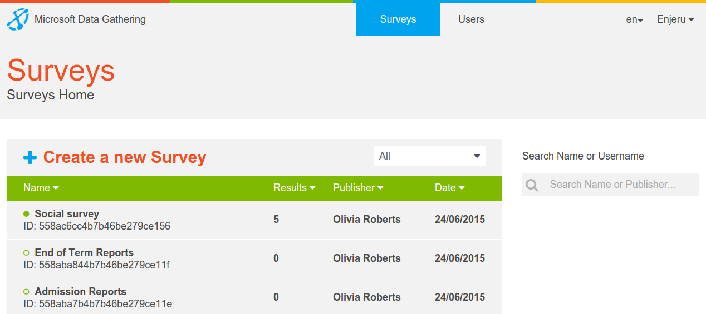
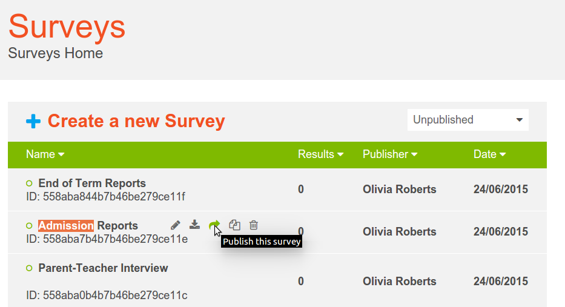

.. _survey-list:

***********
Survey List
***********

The Microsoft Data Gathering server is used to create and make surveys available to registered users and their mobile devices. Responses from the users' mobile devices are sent to the server over the mobile network, a wireless network or a cable connection. The server is also used to export data to CSV and Excel formats, administer users, devices, questionnaires and responses, map real-time GPS-based data, and review results as selected graphics.

After logging in to the server, you will see the list of surveys that are available to you as a user, as in the figure below:

Each survey will have a **SURVEY NAME**, **DATE**, **PUBLISHER** and the number of **RESULTS** that have been sent back for that particular survey. If there are responses received for a particular survey, then the number of responses will appear as a clickable a link to the :doc:`results` page, from which you can view the received responses.

You can filter the surveys by clicking on either **Unpublished** for surveys that are still in the process of being created or built,  **Published** for those that have been made available to users or **All** to show all surveys irrespective of state.

.. figure:: images/building.png
   :alt: Filter
 

To make a survey actually appear on a mobile device for a user, you need to change its status to **Published** (if of course the survey is in the **Unpublished** state). This can be done by clicking on the **Send** button located in the survey toolbar  . 

and then choosing a user or group from the pop up.

** It is important to be clear what Sending a survey to a user actually means. It means that the survey will appear in the NDG application in the list of surveys on the mobile device when that application is started by the user. The user of the mobile device will not be notified of this (however there is an option in the Users section of the server to send an sms message either to individual users or groups which can be used for this purpose). This 'check for new surveys' on the mobile device when the application starts can be turned off in the app settings in which case there is a manual refresh to make new surveys appear** 

.. figure:: images/toolbar_wp.png
   :alt: Windows Phone tools

In the windows phone image above the icons represent **Search**, **Refresh**, **Settings** and **Information**

After a survey is made **Available** by sending it to a user it can no longer be edited. It can however be duplicated and then edited again. To do this click the duplicate icon, again located on the survey toolbar.

.. figure:: images/duplicate.png
   :alt: Duplicate

The new duplicated survey can be edited and saved as needed until it is sent to a device. Then its **Unpublished** status will change to **Published** and no further editing is allowed. Such a process is an easy way to implement simple version control for surveys.

Other functions available in the survey toolbar are **Edit**, **Download**, **Send** and **Delete** in that order

Clicking **Download** opens a browser File Save dialog and the raw survey xml can be saved. This is a useful function if for example the survey can only be passed onto a device using USB or bluetooth as may be the case if no cellular network is available. 

Surveys can also be uploaded. This is a useful function if you would like to download and look at the raw survey xml or perhaps tweak it by hand  and then upload it again.

The upload button is next to the Create Survey button and when uploaded a survey will appear at the bottom of the survey list

The final button on the survey toolbar is **Edit** and clicking this on a survey in the **Building** state shows the :doc:`editor` which is integrated into Microsoft Data Gathering. If rather than editing an existing survey you would like to create a new one click the Create a new Survey button next to the upload button in the image above

