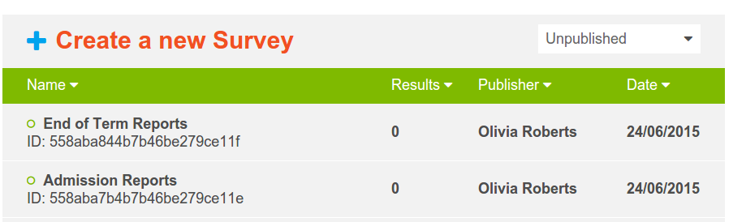

.. _survey-list:

***********
Survey List
***********

The Nokia Data Gathering server is used to create and make surveys available to registered users and their mobile devices. Responses from the users' mobile devices are sent to the server over the mobile network, a wireless network or a cable connection. The server is also used to export data to CSV and Excel formats, administer users, devices, questionnaires and responses, map real-time GPS-based data, and review results as selected graphics.

After logging in to the server, you will see the list of surveys that are available to you as a user, as in the figure below:

.. figure:: images/survey.png
   :alt: Surveys
 
   Survey List

Each survey will have a **SURVEY NAME**, **DATE**, **PUBLISHER** and the number of **RESULTS** that have been sent back for that particular survey. If there are responses received for a particular survey, then the number of responses will appear as a clickable a link to the :doc:`results` page, from which you can view the received responses.

You can filter the surveys by clicking on either **Building** for surveys that are still in the process of being created or built,  or **Available** for those that have been made available to users.

   Survey Filter to show only surveys currently being built

To return to the default list, which shows all surveys (i.e to turn off the filter) click the red highlighted text. 

To send a survey to a device, you need to make it **Available** by clicking on . After a survey is made **Available** it can no longer be edited. It can however be duplicated and then edited again. To do this click the duplicate icon on the survey toolbar.

   Duplicate a survey

The new duplicated survey can be edited and saved as needed until it is sent to a device. Then its **Building** status will change to **Available** and no further editing is allowed. Such a process is an easy way to implement simple version control for surveys.

Other functions available in the survey toolbar are (in order) **Download**, **Upload**, **Send**, **Edit** and **Delete**.

Clicking **Download** opens a browser File Save dialog and the raw survey xml can be saved. This is a useful function if for example the survey can only be passed onto a device using USB or bluetooth as may be the case if no cellular network is available. 

   Download a survey

**Upload** is the same process but in reverse and is only available when **Building** surveys.

.. figure:: images/upload.png
   :alt: Upload Survey

   Survey Upload dialog box

and is a useful function if for example a user has an existing survey created using another Open Rosa compatible survey builder that they wish to use with Nokia Data Gathering. Clicking **Send** presents a list of Users and their corresponding telephone numbers

.. figure:: images/send.png
   :alt: Send Survey

   Send Survey dialog with Usernames and Phone Numbers

select the check box next to the Username and then the Done button to send the survey to that user. 

The final button on the survey toolbar is **Edit** and clicking this on a survey in the **Building** state shows the :doc:`editor` which is integrated in Nokia Data Gathering. If rather than editing an existing survey you would like to create a new one click the plus + icon

.. figure:: images/add-survey.png
   :alt: Add survey

   Survey Creation

