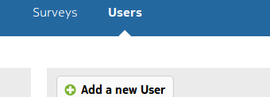
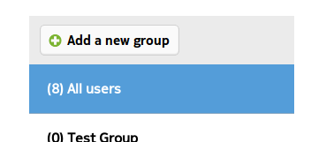
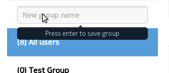
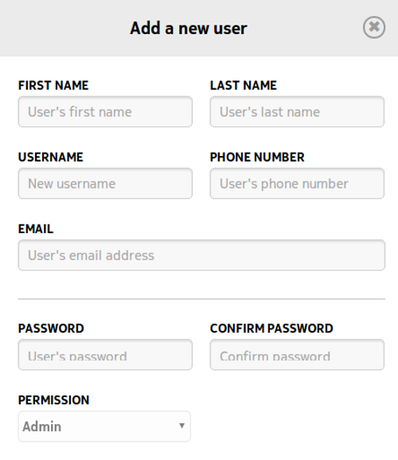
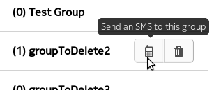
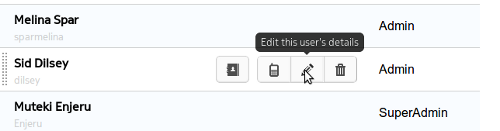

.. _user-admin:

**********
User Admin
**********

The Users section is accessed by clicking the link on the :doc:`survey-list` page.

which presents all the users and groups which belong to the currently logged in user. Both Users and Groups are added by clicking the buttons Add a new User and Add a new group

which opens a field to enter the group name

Adding Users functions the same way by clicking on the button

and the dialogue asks for a number of details about the new user. It is also possible to choose the permissions which will be assigned to the user. 

Both Users and Groups can be deleted by selecting the user or group and choosing the appropriate icon on the toolbar toolbar. It is also possible to send sms messages to users and to all members of the group using this toolbar

as well as edit user information

